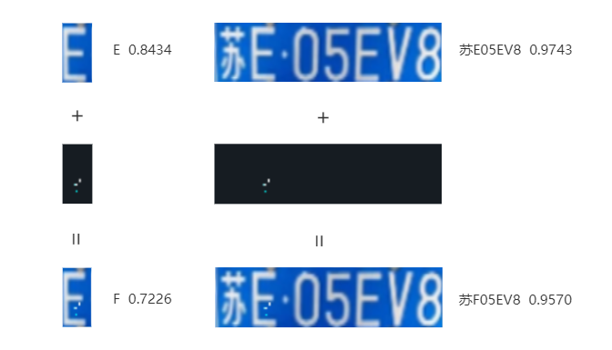

## Differential evolution algorithm generating perturbated image

#### Environment

1. Download `python3.6.8` and `pip 21.3.1`

2. Install dependencies

	```bash
	pip install -r requirements.txt
	```

#### Usage

```bash
python pixel_perturbation.py
```

NOTE:

1. Results can be checked at `.\images_out\Perturbated_Image.jpg` and `.\images_out\Process\...`
2. The original goal of this demo was to implement perturbation attacks on license plate images, but currently only the generation of perturbated  letters has been implemented.

#### Sketch




